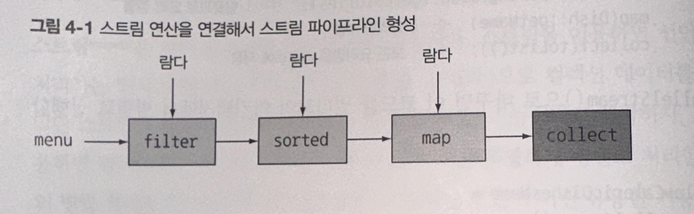

# 스트림 사용

## 스트림이란?
- 한 번에 한 개씩 만들어지는 연속적인 데이터 항목들의 모임

- `Java 8`에서 `java.util.stream` 패키지에 스트림 API가 추가됨

- `Stream<T>`으로 구성된 일련의 항목을 의미함

<br>

⭐ **핵심** : 기존에는 한 번에 한 항목을 처리했지만, 자바 8에서는 우리가 하려는 작업을 고수준으로 추상화 해서 일련의 스트림으로 만들어 처리할 수 있다.

⭐ 스트림 파이프라인을 이용해서 입력 부분을 여러 CPU 코어에 쉽게 할당할 수 있다는 부가적인 이득

➜ 공짜로 병렬성 획득

<br>

### 어려운 멀티스레딩

- **멀티스레딩** 코드를 구현해서 병렬성을 이용하는 것은 쉽지 않음. 

- 멀티스레딩의 핵심은 공유 데이터의 접근을 막는 것

- **스트림**은 "컬렉션을 처리하면서 발생하는 모호함과 반복적인 코드문제" 와 "멀티 코어 활용 어려움" 이라는 두 문제를 모두 해결함

<br>

**스트림 활용**

- 데이터 필터링

- 데이터 추출

- 데이터 그룹화

- 포킹 단계 : 두 CPU에게 데이터를 나누고(forking), 처리 후 합침

<br>

**순차 처리 방식**

```java
import static java.util.stream.Collectors.toList

List<Apple> heavyApples = 
    inventory.stream().fliter((Apple a) -> a.getWeight() > 150)
                      .collect(toList());
```

<br>

**병렬 처리 방식**

```java
import static java.util.stream.Collectors.toList

List<Apple> heavyApples = 
    inventory.parallelStream().fliter((Apple a) -> a.getWeight() > 150)
                      .collect(toList());
```

<br>

### 스트림 예시

**[기존 방식]** `for`문을 이용하여 반복문으로 필터링 하는 모습이다.

```java
List<Dish> lowCaloricDishes = new ArrayList<>();

// 칼로리가 400 이하가 되는 메뉴를 찾음
for(Dish dish : menu){
    if(dish.getCaories() < 400) {
        lowCalricDishes.add(dish);
    }
}

// 익명 클래스로 요리 정렬
Collections.sort(lowCaloricDishes, new Comparator<Dish>() {
    public int compare(Dish dish1, Dish dish2){
        return Integer.compare(dish1.getCalories(), dish2.getCalories())
    }
});

// 정렬된 리스트에서 요리 이름을 선택함
List<String> lowCaloricDishesName = new ArrayList<> ();
for(Dish dish: lowCaloricDishes){
    lowCaloricDishesName.add(dish.getName());
}
```

**[자바 8]** 스트림을 사용하면, 필터링과 그룹화 하는 코드를 간결하게 작성할 수 있다.

```java
import static java.util.Comparator.comparing;
import static java.util.stream.Collectors.toList;

List<String> lowCaloricDishesName = 
        menu.stream()
            .filter(d -> d.getCalories < 400) // 400칼로리 이하의 요리 선택
            .sorted(comparing(Dish::getCalories)) // 칼로리로 요리 정렬
            .map(Dish::getName) // 요리명 추출
            .collect(toList()); // 모든 요리명을 리스트에 저장
```

여기서 `stream()`을 `parallelStream()`으로 바꾸면 멀티코어 아키텍처에서 병렬로 실행한다.

<br>

### 고수준 빌딩 블록


- `filter`, `sorted`, `map`, `collect`의 연산은 특정 스레딩 모델에 제한되지 않고 자유롭게 어떤 상황에서든 사용할 수 있다.

- **필터 → 정렬 → 변환 → 수집** 의 단계로 이루어져, 이 순서를 지키면 병렬성을 보장 받는다.

<br><br>

## 스트림과 컬렉션

- 컬렉션 : 현재 자료구조가 포함하는 모든 값을 메모리에 저장하는 자료구조

- 스트림 : 요청할 때만 요소를 계산하는 고정된 자료구조
    - 단 한번만 소비할 수 있다!!

<br>

### 외부 반복과 내부 반복

- **[외부 반복]** : 사용자가 명시적으로 반복 (컬렉션에서 사용)
 
    ```java
    List<String> names = new ArrayList<> ();

    for(Dish dish : menu) {
        names.add(dish.getName());
    }

    ```

- **[내부 반복]** : 반복을 알아서 처리하고 결과 스트림 값을 어딘가에 저장 (스트림에서 사용)

    ⭐  **내부 반복의 장점** : 자바가 작업을 투명하게 병렬로 처리하거나 더 최적화된 다양한 순서로 처리 가능
    ```java
    List<String> names = 
        menu.stream()
            .map(Dish::getName())
            .collect(toList());                      
    ```

<br>

### 스트림 이용하기

- **중간 연산**

| 연산 | 형식 | 반환 형식 | 연산의 인수 | 함수 디스크립터 | 
| :--: | :--: | :--: | :--: | :--: |
|filter | 중간 연산 | `Stream<T>` | `Prediate<T>` | T -> boolean |
| map | 중간 연산 |  `Stream<R>` | `Functional<T, R>` | T -> R |
| limit | 중간 연산 |  `Stream<T>` | |  |
| sorted | 중간 연산 |  `Stream<T>` | `Comparator<T>` | (T, T) -> int |
| distinct | 중간 연산 |  `Stream<T>` | |  |

- **최종 연산**

| 연산 | 형식 | 반환 형식 | 목적 | 
| :--: | :--: | :--: | :-- | 
| forEach | 최종 연산 | void | 스트림의 각 요소를 소비하면서 람다를 적용 |
| count | 최종 연산 | long(generic) | 스트림의 요소 개수를 반환한다 |
| collect | 최종 연산 | | 스트림을 리듀스해서 리스트, 맵, 정수 형식의 컬렉션을 만든다.


<br><br><br>

# 스트림 활용

## 필터링

### Predicate로 필터링

- `Predicate` : 불리언을 반환하는 함수

```java
List<Dish> vegeterianMenu = 
        menu.stream()
            .filter(Dish::isVegetrian) // 프레디케이트로 필터링
            .collect(toList());
```

### 고유 요소 필터링

- 고유 여부는 스트림에서 만든 객체의 `hashCode`, `equals`로 결정됨

```java
List<Integer> numbers = Arrays.asList(1, 2, 1, 3, 3, 2, 4);

numbers.stream()
        .filter(i -> i % 2 == 0)
        .distinct() // 고유 요소만 추출
        .forEach(System.out::println);
```
➜ `filter`에서 결과가 **[2, 4, 4]** 가 나왔다면 최종 결과는 **[2, 4]** 가 나올 것

<br>

## 스트림 슬라이싱
- 스트림의 요소를 선택하거나 스킵하는 다양한 방법

### Predicate를 이용한 슬라이싱 (자바 9)

```java
[
    Dish("...", ..., 120, ...),
    Dish("...", ..., 300, ...),
    Dish("...", ..., 400, ...),
    Dish("...", ..., 420, ...),
    Dish("...", ..., 450, ...),
    Dish("...", ..., 600, ...),
]
```
이렇게 `Dish`가 `ArrayList`로 되어 있을 때, `filter`를 사용하면 320칼로리 이하의 요리를 선택할 수 있다.

하지만, 칼로리 순으로 정렬되어 있으므로 슬라이싱을 통해서 하는 것이 효과적이다

- `TAKEWHILE` 활용 : Predicate가 참이 되는 구간을 슬라이싱 (320보다 작은 구간 사용)

```java
List<Dish> slicedMenu1 = 
        specialMenu.stream()
            .takeWhile(dish -> dish.getCalories() < 320) // 프레디케이트로 슬라이싱
            .collect(toList());
```

- `DROPWHILE` 활용 : Predicate가 거짓이 되는 구간을 슬라이싱 (320보다 큰 구간 사용)

```java
List<Dish> slicedMenu1 = 
        specialMenu.stream()
            .dropWhile(dish -> dish.getCalories() < 320) // 프레디케이트로 슬라이싱
            .collect(toList());
```
<br>

### 스트림 축소

- `limit` 사용
```java
List<Dish> vegeterianMenu = 
        menu.stream()
            .filter(Dish::isVegetrian) 
            .limit(3) // 3개 까지만 선택함
            .collect(toList());
```

<br>

### 요소 건너뛰기

- `skip` 사용
```java
List<Dish> vegeterianMenu = 
        menu.stream()
            .filter(dish -> dish.getCalories() > 300) 
            .skip(2) // 300 칼로리 넘는 요리부터 2개는 뛰어넘음, 그 이후부터 출력함
            .collect(toList());
```
<br>

## 매핑

### 스트림 평면화

- `["Hello", "World"]` 리스트를 고유 문자로 반환해보자 
→ `["H", "e", "l", "o", "W", "r", "d"]`

- `flatMap` 사용

```java
List<String> uniqueCharacters = 
        words.stream()
            .map(word -> word.split("")) // map의 리턴 타입은 `Stream<Array>`
            .flatMap(Arrays::stream) // 위에서 생성된 스트림을 하나의 스트림으로 평면화
            .distinct()
            .collect(toList());
```

<br>

## 검색과 매칭

### Predicate가 적어도 한 요소와 일치하는지 확인

```java
boolean isAnyMatch = menu.stream().anyMatch(Dish::isVegetarian);
```

<br>

### Predicate가 모든 요소와 일치하는지 확인

```java
boolean isAllMatch = menu.stream().allMatch(dish ->  dish.getCalories() < 1000);
```

<br>

### Predicate가 일치 하는 요소가 없는지 확인

```java
boolean isNoneMatch = menu.stream().noneMatch(d -> d.getCalories() < 1000);
```
<br>

### 아무거나 찾기 findAny

- `Optional<T>` 클래스를 이용하여 값의 존재나 부재 여부를 표현하는 컨테이너 클래스

- null이 담길 수 있으니, 에러를 발생시키지 않는 `Optional<T>` 클래스 사용

```java
Optional<Dish> dish = 
    menu.stream()
        .filter(Dish::isvegeterian)
        .findAny();
```

- `ifPresent` : 값이 있으면 주어진 블록을 실행한다.

```java
menu.stream()
    .filter(Dish::isvegeterian)
    .findAny()
    .ifPresent(dish -> System.out.println(dish.getName()));
```
<br>

### 첫 번째 요소 찾기 findFirst

```java
List<Integer> someNumbers = Arrays.asList(1, 2, 3, 4, 5);
Optional<Integer> fisrtSquareDivisibleByThree = 
     someNumbers.stream()
                .map(n -> n * n)
                .filter(n -> n % 3 == 0)
                .findFirst(); // 9           
```

<br><br>

## 리듀싱
- 스트림의 모든 요소를 반복적으로 처리하기 위함
<br>

### 요소의 합

```java
int sum = numbers.stream().reduce(0, (a, b) -> a + b); // 모든 값 덧셈, 첫 번째 인수 0
```

```java
int sum = numbers.stream().reduce(0, Integer::sum); // Integer 클래스는 두 숫자를 더하는 정적 sum 메소드 제공
```
<br>

### 요소의 곱

```java
int sum = numbers.stream().reduce(1, (a, b) -> a * b); // 모든 값 곱셈, 첫 번째 인수 1
```

### 초기 값 없음
```java
Optional<Integer> sum = numbers.stream().reduce((a, b) -> (a + b)); // 초기 값이 없어서 Optional 클래스 사용
```

### 최대값과 최솟값
```java
Optional<Integer> max = numbers.stream().reduce(Integer::max); // 초기 값이 없어서 Optional 클래스 사용
```

```java
Optional<Integer> min = numbers.stream().reduce(Integer::min); // 초기 값이 없어서 Optional 클래스 사용
```

### 리듀스의 장점

- `parallelStream`으로 변경하면, 병렬화가 가능하다

