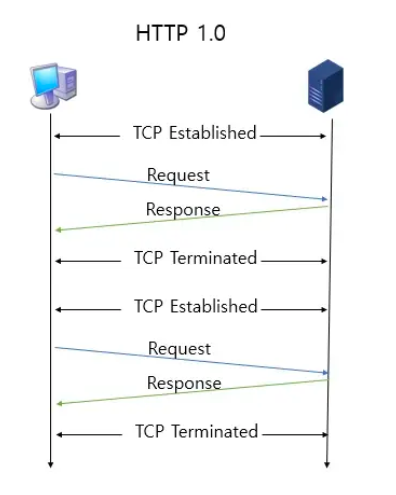
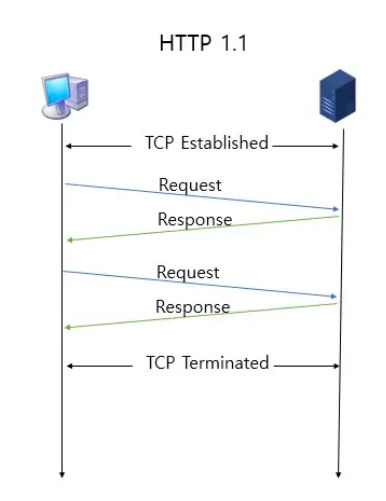
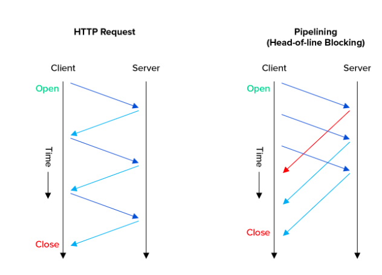
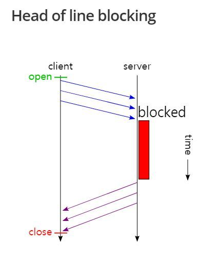

# HTTP

## 1. HTTP 1.0

HTTP 1.0은 한 연결당 하나의 요청을 처리하도록 설계

계속해서 `3-way Handshake`로 연결해야 해서,  이는 RTT 증가를 불러오게 되었습니다.

    *RTT : 패킷이 목적지에 도달하고 나서, 다시 출발지로 돌아오기까지 걸리는 시간 
    패킷 왕복 시간



- RTT 증가를 해결하기 위한 방법
    
    매변 연결할 때마다 서버에 부담이 많이가니, 한 번에 보내려는 시도가 있었습니다.

    - **이미지 스플리팅** : 많은 이미지를 다운로드를 받게되면, 과부하가 걸리기 때문에 합쳐 있는 하나의 이미지를 다운로드받음.

    - **코드 압축** : 코드에서 개행 문자, 빈칸을 없애서 크기를 최소화

    ```c
    #include <stdio.h>

    int main(){
        int a = 0;
        return a;
    }
    ```
    이 코드를 다음과 같이 바꾸는 방법입니다.

    ```c
    #include <stdio.h>int main(){int a=0;return a;}
    ```

    - 이미지 Base64 인코딩
    
    이미지 파일을 64진법으로 이루어진 문자열로 인코딩 하는 방법, Base64 문자열로 변환할 경우 37% 정도 크기가 더 커지는 단점이 있다.

<br><br>


## 2. HTTP 1.1 

> 매번 TCP 연결을 하는 것이 아니라, 한 번 TCP 초기화를 한 이후에 keep-alive라는 옵션으로 여러개의 파일을 송수신 할 수 있게 변경되었다.



기존에 하나의 요청에 하나의 응답을 처리할 수 있었다. 

하지만, HTTP 1.1에서는 Pipelining을 사용하여 여러 요청을 한 번을 다룰 수 있다.

<br>


### HOL Blocking


하지만, 첫번째 패킷이 크기가 크면, 두번째 세번째의 응답이 `blocking`된다.


<br>


### 무거운 헤더 구조

HTTP 1.1 헤더에는 쿠키 등 많은 메타데이터가 들어있고 압축이 되지 않아 무거움.

<br>

## 3. HTTP 2

> HTTP/2는 SPDY 프로토콜에서 파생된 HTTP/1.x보다 지연 시간을 줄이고 응답 시간을 더 빠르게 할 수 있으며 **멀티플렉싱, 헤더 압축, 서버 푸시, 요청의 우선순위 처리**를 지원하는 프로토콜

<br>


### 멀티 플렉싱 
- 여러개의 스트림을 사용하여 송수신

- 특정 스트림의 패킷이 손실되어도, 해당 스트림에만 영향을 미치고 나머지 스트림은 멀쩡히 동작


하나의 TCP 연결에서 여거래긔 스트림으로 데이터를 쪼개어 송수신하는 모습이다.

이렇게 하면, 단일 연결로 **병렬로 여러 요청을 받을 수 있고, 응답을 줄 수 있다.**

🍋 HOL Blocking을 해결할 수 있다!

<br>


### 헤더 압축
HTTP/2 에서는 헤더 압축을 써서 해결한다.

 **허프만 코딩 압축 알고리즘을 사용**하는 **HPACK** 압축 형식을 가진다.

> 허프만 코딩 : 문자열을 문자 단위로 쪼개 빈도가 높은 정보는 적은 비트 수를 사용
- 빈도가 낮은 정보는 비트 수를 많이 사용하여 표현  → 전체 데이터의 표현에 필요한 비트양 줄이기

<br>


### 서버 푸시

HTTP/1.1에서는 클라이언트가 서버에 요청을 해야 파일을 다운로드 받을 수 있었다면, HTTP/2는 클라이언트 요청 없이 서버가 바로 리소스를 푸시할 수 있다.


<br>

## 4. HTTPS

HTTP/2는 HTTPS 위에서 동작한다.

HTTPS는 어플리케이션 계층과 전송 계층 사이에 신뢰 계층인 SSL/TLS 계층을 넣은 신뢰할 수 있는 HTTP 

<br>

### SSL/TLS
- SSL 1.0 부터 시작해서 SSL 2.0 / SSL 3.0 / TLS 1.0 / TLS 1.3 까지 버전이 올라갔다.

- 전송 계층에서 보안을 제공하는 프로토콜

- 클라이언트와 서버가 통신 할 때, 제 3자가 메시지를 도청하거나 변조하지 못하도록 한다.


- 공격자가 서버인척 하며 사용자 정보를 가로채는 네트워크상의 '인터셉터'를 방지할 수 있다.

- **TLS의 핸드쉐이크** : 클라이언트와 서버가 키를 공유하고, 이를 기반으로 인증, 인증 확인 등의 작업이 일어나는 1-RTT가 생긴 후 데이터를 송수신 한다.
    - 클라이언트에서 사이퍼 슈트를 서버에 전달하면, 서버는 암호화 알고리즘 리스트를 제공할 수 있는지 확인한다.
    - 제공할 수 있다면, 서버에서 클라이언트로 인증서를 보내는 인증 매커니즘이 시작되고, 해싱 알고리즘 등으로 암호화된 데이터의 송수신이 시작된다.

        * 사이퍼 슈트 : **프로토콜, AEAD 사이퍼 모드, 해싱 알고리즘**이 나열된 규약
            
            EX ) TLS_AES_128_GCM_SHA256
            - TLS : 프로토콜
            - AES_128_GCM : AEAD 사이퍼모드 (데이터 암호화 알고리즘)

            - SHA256 : 해싱 알고리즘

- 인증 매커니즘

> CA에서 발급한 인증서를 기반으로 이루어짐. '공개키'를 클라이언트에 제공하고, 사용자가 접속한 '서버가 신뢰'할 수 있는 서버임을 보장한다. CA는 엄격하게 공인된 기업들만 참여가 가능하다.

<br>

### HTTPS 구축 방법
- CA에서 직접 구매한 인증키를 구반으로 HTTPS 서비스를 구축

- 서버 앞단에 HTTPS를 제공하는 로드밸런서를 두기

- 서버 앞단에 HTTPS를 제공하는 CDN 두기

<br>


### Spring 에서 HTTP/2 구축하기

1. `application.properties` 파일에서 `server.http2.enabled`을 `true`로 변경해주기 

2. SSL 적용이 필수, SSL 적용해주자

3. JAVA KeyTool을 사용하여 인증서 생성이 가능하고, SSL 설정이 가능하다.
    - 내부에 인증서를 만들어 인증서 파일을 보관한다

<br>

## 5. HTTP/3
> HTTP/3는 QUIC이라는 계층 위에서 돌아가며, TCP 기반이 아닌 UDP 기반으로 동작

- 3-way Handshake 방식 사용하지 않음

- QUIC는 순방향 오류 수정 매커니즘 적용
    - 패킷이 손실되면, 수신 측에서 에러를 검출하고 수정하고

    - 열악한 네트워크 환경에서도 낮은 패킷 손실률을 자랑
