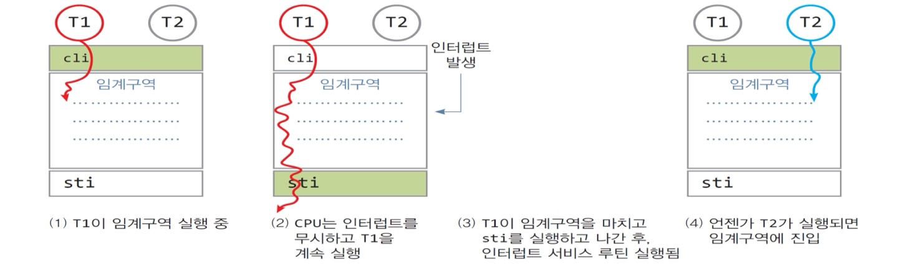
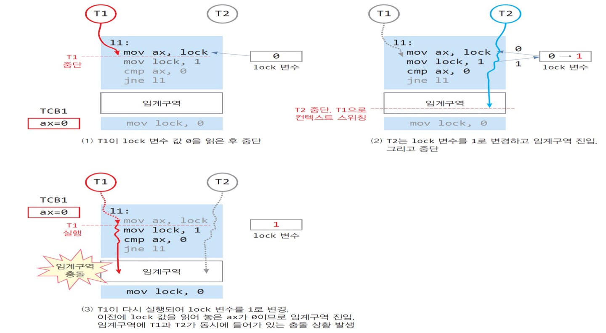
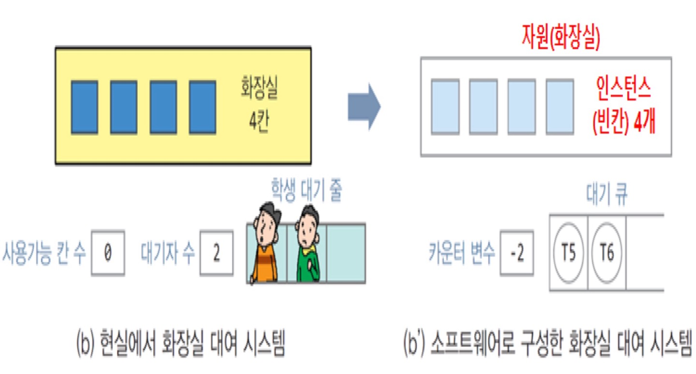
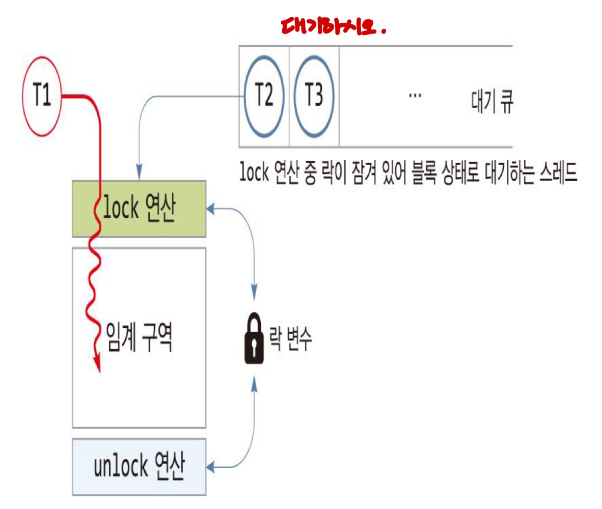
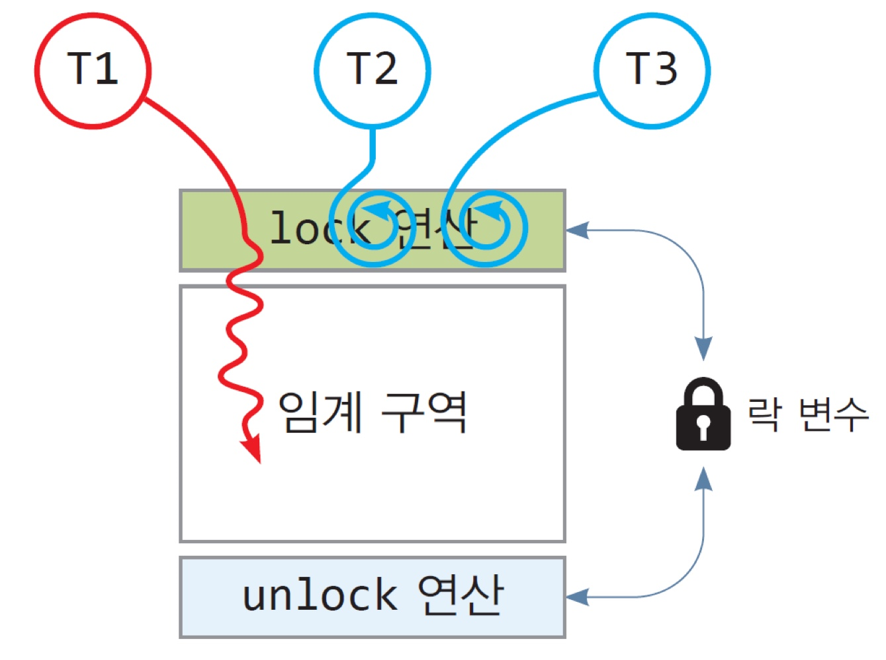
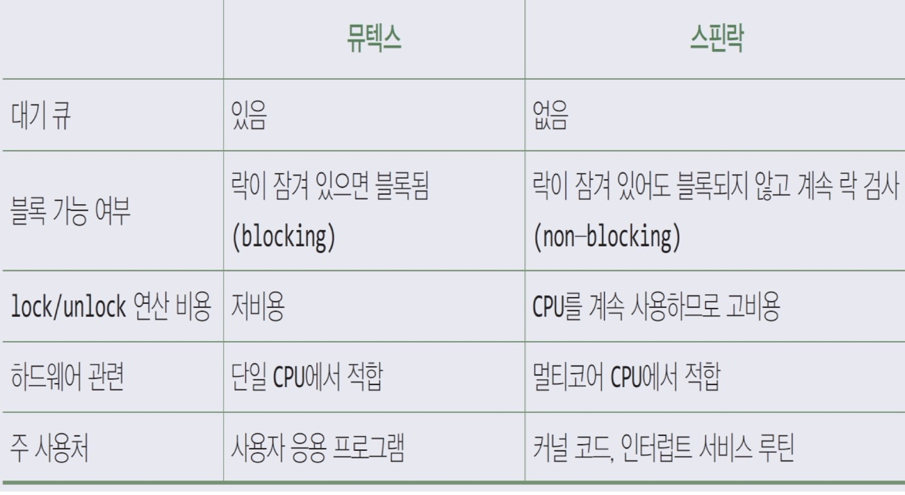
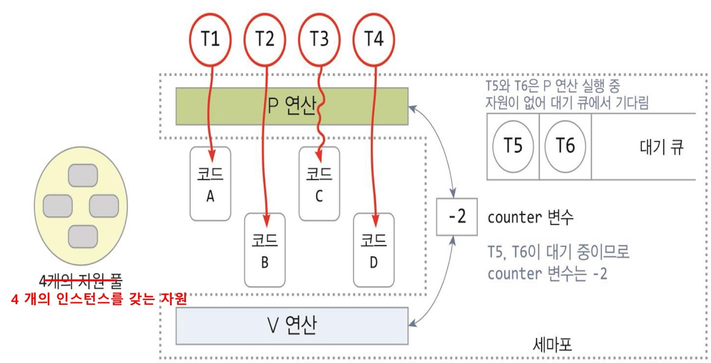
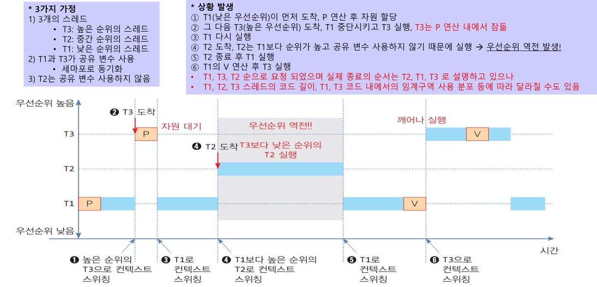
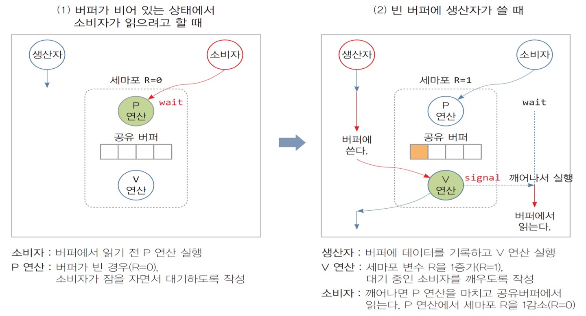
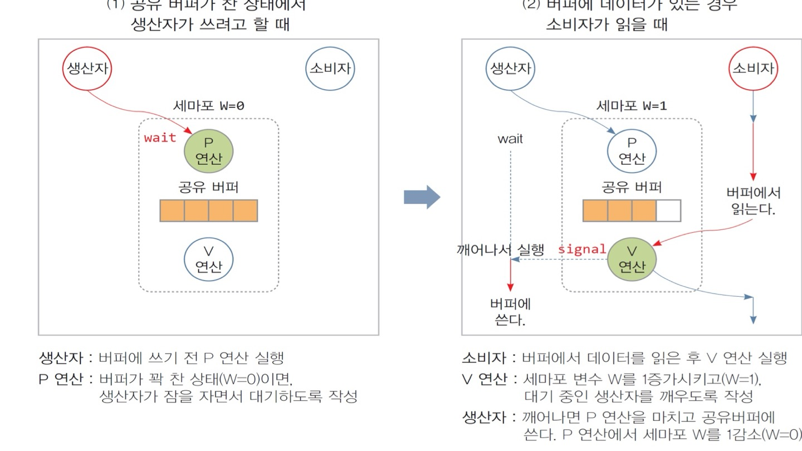

# 6. 스레드 동기화

## 1. 스레드 동기화의 필요성

### 스레드 동기화의 필요성

🚨 **다수의 스레드가 동시에 공유 데이터에 쓰기를 접근하면?**
→ 공유 데이터가 훼손되는 문제 발생 가능
- 두 스레드가 동시에 공유 데이터에 쓰는 경우

 

**스레드 동기화** : 공유 데이터에 대한 다수의 스레드가 동시에 접근할 때 공유 데이터가 훼손되지 않게하는 기법
- 한 스레드가 공유 데이터를 **배타적 독점적으로 접근**하도록 순서화

- 한 스레드가 쓰기를 하고 있으면 **다른 스레드는 대기 해야 함**

 

### 공유 데이터 접근 문제의 해결책

- 문제점 1 : 여러 스레드가 공유 변수에 접근할 때, 공유 데이터가 훼손 됨

- 문제점 2 : 하나의 스레드가 데이터를 수정한 뒤에, 다른 스레드가 이 수정된 데이터를 이어서 사용해야하는 경우 문제

- 해결책 1 : 한 스레드가 공유 변수 사용을 다 마칠 때까지, 다른 스레드가 공유 데이터에 접근하지 못하도록 제어 (**상호배제**)

- 해결책 2 : 우선 처리되어야 할 스레드가 수행을 마친 후, 후속되는 스레드가 시작되도록 순서를 조정 (**협의의 동기화**)

 

### 임계구역과 상호배제

- 임계구역 : 공유 데이터에 접근하는 프로그램 코드들

- 상호배제 : 임계 구역을 오직 한 스레드만이 배타적 독점적으로 사용하도록 하는 기술 
    - 하나의 스레드만 임계구역을 허용 할 수 있는 것이 아니라, OS 마다 여러개의 스레드를 허용할 수도 있다.

 

## 2. 상호배제
    원자적 연산 : 연산의 수행을 시작해서 끝날 때 까지 중단되지 않고, 동작하는 것을 의미

- 일반 코드 : 공유 데이터를 액세스 하지 않는 코드 (원자적 연산이 아님)

- 임계구역 진입 코드 (원자적 연산 필요)
    - 임계구역에 진입하기 위해서 필요한 코드 블록 (상호배제 필요)

    - 현재 임계구역을 실행 중인 스레드가 있는지 검사
        - 없다면 다른 스레듣가 들어오지 못하도록 함
        - 있다면, 진입이 가능할 때 까지 대기

- 임계구역 코드 : 원자적 연산이 아니나 가급적 짧게 작성
    - 임계구역 실행 중에도 운영체제에 의해 다른 스레드로 스케줄링이 가능함

- 임계구역 진출 코드 (원자적 연산 필요)

    - 임계구역을 마칠 때 필요한 코드 블록 (상호배제 필요 )

 

### 상호 배제 구현 방법 정리

- 소프트웨어적 방법 : `Peterson's Algorithm`, `Dekker's algorithm`

- 하드웨어적 방법 
    - 인터럽트 서비스 금지 : 여러개의 CPU가 있는 경우 문제점 발생

    - 원자 명령 (TLS) : 하나의 인스턴스가 있을 경우 사용. 락 변수(0, 1) 사용, CPU 명령임

- OS, 프로그래밍 언어 사용 방법
    - 뮤텍스
        - 하나의 인스턴스
        - 락 변수 사용하며 Sleep-Wating lock 기법 사용
        - 락을 건 스레드만이 락 해제가 가능

    - 스핀락
        - 뮤텍스 방식과 동일하나 busy-wating lock 기법 사용

    - 카운터 세마포
        - 복수개의 인스턴스를 갖는 경우 사용

        - 세마포 변수, P/V 연산 사용
        - P 연산과 V 연산을 하는 스레드가 다를 수 있음

    - 이진 세마포

        - 한개의 인스턴스

        -  그외는 카운터 세마포와 동일

 

### 상호배제 구현

- **목표**
    - 오직 1개의 스레드만이 임계구역의 코드를 사용하게 함

    - 실제로는 허용된 개수의 스레드만큼 허용함

 

### 인터럽트 서비스 금지

- 진입 코드에서 인터럽트 서비스를 금지하는 명령 실행

- 인터럽트가 발생해도, CPU가 인터럽트 발생을 무시

- 인터럽트를 무시하면 임계구역을 싱행하는 스레드가 중단되지 않음

- **문제점**
    - 모든 인터럽트가 무시되는 문제 발생

    - 한 CPU에서 인터럽트를 무시하면 다른 코어의 인터럽트도 무시하는 문제 발생

 

### 원자 명령 사용
- 기존
    - `moc ax, lock` : lock 변수를 읽고
    - `mov lock, 1` lock 변수를 1로 만든다
    
    → 문제점 : 두개의 명령어 사이에 컨텍스트 스위칭이 일어난다면?
    
    동시에 임계 구역에 들어가버리는 문제!

`TSL ax, lock` : 하나의 명령어로 합쳐서, 컨텍스트 스위칭이 일어나지 않도록 함

 

##  3. 멀티 스레드 동기화 기법
### 멀티스레드 동기화
- 상호배제 기반 위에, 자원을 사용하려는 여러 스레드들이 특정 자원을 원활히 공유하도록 하는 기법

    - 공유되는 자원마다 별도로 해당 공유자원에 대한 동기화 기법을 적용한다 

- lock 방식 : 뮤텍스, 스핀락
    - 상호배제가 되도록 만들어진 lock 변수를 활용

    - 락을 소유한 스레드만 임계구역 진입

- wait-signal 방식 : 세마포

    
    - n개의 인스턴스를 갖는 자원을 사용하려는 m개의 멀티스레드의 원활한 관리

    - 자원을 소유하지 못한 스레드는 대기(wait)

    - 자원을 다 사용한 스레드는 알림(signal)

 

### 뮤텍스 

- 잠김/열림 한 상태를 가지는 락 변수  이용
- **오직 한 스레드**만 임계구역에 진입시키고 다른 스레드는 **큐에 대기**

- **sleep-waiting lock** 기법

- lock 연산 
    - 락이 열린 상태면, 락을 잠그고 임계구역 진입

    - 락이 잠김 상태이면, 현재 스레드를 블록 상태로 만들고, 대기  큐에 삽입

- unlock 연산
    - 락을 열림 상태로 변경하고, 대기 큐에 있는 스레드를 하나 호출

    - 락을 소유한 스레드만 락의 해제가 가능

- 특징
    - 임계구역의 실행 시간이 짧으면, 컨텍스트 스위칭이 되어야 하므로 비효율적

 

### 스핀락

- **busy-wating-lock** 기법

- 대기큐가 없고, 락이 열릴 때 까지 계속해서 락 변수 검사를 반복함

- lock 연산 
    - 락이 열린 상태면, 락을 잠그고 임계구역 진입

    - 락이 잠김 상태이면, 락이 풀릴 때 까지 무한 루프를 돌면서 lock 연산 시도한다

- unlock 연산
    - 락을 열림 상태로 변경하고, 대기 큐에 있는 스레드를 하나 호출

    - 락을 소유한 스레드만 락의 해제가 가능1

- 특징 : 단일 CPU를 가진 웅영체제에서 비효율적
    - 어짜피 단일 코어에서는 다른 스레드는 실행이 안되므로 비효율적임

    - 멀티 코어에 적합함

    - 임계구역의 실행 시간이 짧은 경우에만 효과적임 (컨텍스트 스위칭이 없기 때문에)
    - 기아 발생 가능

 

### 세마포

- n개의 공유 자원을 다수 스레드가 공유하여 사용하도록 돕는 자원 관리 기법

- 자원 내의 인스턴스 → n개의 인스턴스

- 대기 큐

- counter 변수 : 사용가능한 자원의 인스턴스 개수 

- P 연산 : 자원을 요청할 때 실행하는 연산 → 임계구역 진입

- V 연산 : 자원을 반환할 때 실행하는 연산 → 임계구역 진출

- 2가지 구현 방식
    - sleep-wait 세마포 : 대기 큐 사용
        - P 연산 : counter 값 하나 감소 (음수 일 때는 대기 큐에 대기하고 있는 갯수)                  
        - V 연산 : counter 값 하나 증가

    - busy-wait 세마포 : 사용가능 할 때까지 무한 루프로 진입 시도

 

### 카운터 세마포와 이진 세마포
- 카운터 세마포 : 한개의 자원에서 여러개의 인스턴스를 지원하는 세마포

- 이진 세마포 : 한개의 자원에서 하나의 인스턴스 만을 지원하는 세마포 
    - 뮤텍스, 스핀락과 동일하지만, **이진 세마포는 다른 스레드가 V 연산이 가능**

 

### 동기화 이슈 : 우선순위 역적

- 우선 순위 역전 : 스레드 동기화로 인해, 높은 순위의 스레드가 늦게 스케줄링 되는 현상

- 문제점 : 실시간 시스템의 근본 붕괴

- 해결책 1 : 우선순위 일시적으로 올림
- 해결책 2 : 우선순위 상속
    - 낮은 순위의 스레드가 공유자원을 가지고 있으면, 우선순위를 높게 설정하여 빨리 실행시킴

 

## 4. 생산자 소비자 문제

### 생산자 소비자 문제란?
- 공유 버퍼를 사이에 두고, 데이터 공급만하는 생산자들과 데이터를 읽고 소비만 하는 소비자들이 문제 없이 사용하도록 동기화 시키는 문제란

- **문제점**
    - 비어 있는 공유 버퍼 문제 : 소비자가 읽을 때
        - 세마포 R을 활용해서, 읽기 가능한 버퍼 개수를 살피는 `P/V` 연산 사용

        
    - 꽉찬 공유 버퍼 문제 : 생산자가 쓸 때
        - 세마포 W을 활용해서, 꽉 찬 버퍼를 처리하는 `P/V` 연산 사용
        
        

    - 상호 배제 해결 : 공유 버퍼에 대한 상호배제

        - 하나의 공유 버퍼에 2개의 세마포(R, W)가 존재하여 관리가 어려움

        - 뮤텍스를 사용해서, 공유 버퍼의 사용을 잠근다.