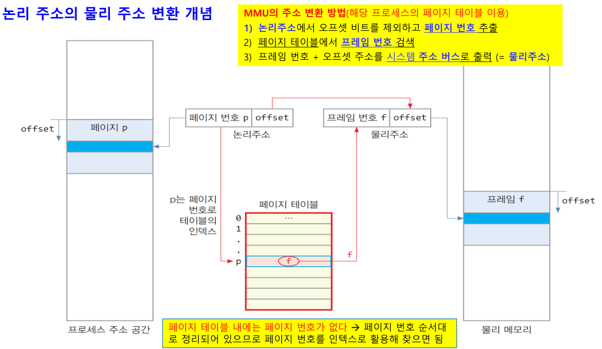

# 페이징이란?
페이징을 알기 위해서는 먼저 페이지와 프레임에 대해 알아야 한다.

### 페이지(논리주소 공간)
- 프로세스의 논리주소 공간을 0번지부터 동일한 크기의 **페이지**로 나눔
- 모든 페이지에 0부터 순서대로 일련번호(페이지 번호)를 붙임

- 페이지 크기
  - 운영체제에 따라 다르지만 주소 4KB(주소선 12개 -> 2^12)로 설정

- 페이지 테이블
  - 프로세스의 각 페이지에 대해 페이지 번호와 프레임 번호를 1:1로 저장하는 테이블
  - 프로세스 생길 때 프로세스마다 하나 씩 페이지 테이블이 커널 영역에 생성됨
  - MMU는 페이지 테이블을 통해 논리 주소를 물리 주소로 변환

### 프레임(물리주소 공간)
- 물리 메모리 공간을 0번지부터 페이지 크기로 나누어 프레임(슬롯)을 만듬
- 모든 프레임에 0부터 순서대로 일련번호(프레임 번호)를 붙임

> [!NOTE]
> ### 페이징 기법
> - 프로세스 논리 주소 공간과 물리 메모리를 페이지 크기로 동일하게 분할
> - 프로세스의 각 페이지를 물리 메모리의 프레임에 분산 할당하여 관리하는 기법
> - 즉, 페이지 테이블에서 페이지 번호와 프레임 번호를 이용하여 관리
> 
> 

### 페이징 장점(세그먼테이션 기법 대비)
- 구현방법 용이
  - 0번지부터 고정크기로 분할하여 할당하기 떄문에 메모리 관리 쉬움
- 높은 이식성
  - CPU에 의존적이지 않아서 다양한 컴퓨터에 쉽게 이식 가능
- 높은 융통성
  - 시스템이나 응용 프로그램에 따라서 페이지 크기를 다르게 설정할 수 있음
- 메모리 활용과 시간 오버헤드에서 우수
  - 홀 선택 알고리즘 실행할 필요 없음
    - 페이지, 프레임 모두 고정 크기이므로 홀 선택할 필요 없음
  - 내부 단편화 발생하지만 마지막 페이지에서만 발생하고 매우 작음
    - 만약 페이지 크기가 4KB이고 프로세스가 10KB를 요청했을 때 처음 페이지와 두 번쨰 페이지는 모두 사용되는 반면 마지막 페이지는 2KB만 사용하고 나머지 2KB에는 단편화가 발생한다.

## 페이지와 페이지 테이블
### 4GB 주소 공간을 갖는 프로세스의 페이지와 프레임
- 페이지의 크기: 4KB
- 코드, 데이터, 힙, 스택 공간을 사진과 같이 페이지와 프레임 할당
  
- 프로세스는 6개의 페이지를 실제로 사용한다.
  - 힙과 스택은 동적이기 때문에 동적으로 동적으로 추가 할당 가능

### 페이지 동적 할당(힙 영역)
- 힙 영역에 추가 할당받는 상황이다.
- 200바이트를 할당 받지만 페이지의 크기는 4KB이기 때문에 4KB의 페이지 5를 할당 받는다.
- 할당 받은 페이지는 프레임 2에 할당된다.
  

# 페이징의 주소 체계
## 페이징의 논리 주소 
페이지 크기가 4KB(==2^12)라면 페이지의 논리 주소는 다음과 같이 구성되어있다.
- 페이지 번호(p)
  - 페이지를 구성하는 내부 공간은 12비트 주소(A11 ~ A0)로 표현
- 옵셋(offset)
  - 옵셋 크기는 12bit
- 32bit 논리 주소 체계에서, 상위 20bit는 페이지 번호이고 하위 12bit은 옵셋

### 논리 주소 -> 물리 주소 변환(페이지 -> 페이지 테이블 -> 프레임)
MMU의 주소 변환 방법
- 논리 주소에서 오프셋 비트를 제외하고 페이지 번호를 추출
- 페이지 번호로 페이지 테이블 인덱스 검색
- 찾은 페이지 테이블 인덱스에서 프레임 번호 검색
- 프레임 번호 + 오프셋 주소를 시스템 주소 버스로 출력 (== 물리 주소)

# 페이지 테이블의 문제점과 TLB
## 문제점1: 1번의 물리 메모리 액세스를 위해서 2번의 물리 메모리 액세스가 필요
- 페이지의 프레임 주소 정보를 갖고 있는 페이지 테이블은 물리 메모리에 저장되어 있다.
- 페이지 테이블에 접근해서 프레임 주소를 갖고 오고 해당 프레임 주소로 접근하여 총 2번의 물리 메모리 액세스가 필요하다.
- 이는 실행 속도 저하 문제를 일으킨다.
- 이러한 문제를 **TLB**를 통해 해결한다.

## 문제점1 해결 방안 - TLB(Translation Look-aside Buffer)
> [!NOTE]
> #### TLB(Translation Look-aside Buffer)란?
> 논리 주소를 물리 주소로 바꾸는 과정에서 캐시를 이용해 메모리에 있는 페이지 테이블을 읽어오는 시간을 없애거나 줄이는 기법

- 최근에 사용된 몇 개의 ‘페이지 번호와 프레임 번호’ 의 쌍들을 MMU 내부에 저장하는 빠른 캐시 메모리
- 주소 변환 캐시(address translation cache)라고도 불린다.

- TLB 캐시의 구조와 특징
  - [페이지 번호 p, 프레임 번호 f]를 항목으로 저장
  - 페이지 번호로 전체 캐시를 동시에 고속 검색해서 프레임 번호 출력(연관 메모리 검색 방식 사용)
  - 연관 메모리는 매우 비싸기 때문에 용량을 작게 사용

  

  > [!TIP]
  > #### 연관 메모리
  > "주소 기반"이 아닌 "내용 기반"으로 데이터를 검색할 수 있는 메모리

####  TLB를 활용한 메모리 액세스 과정
- **TLB hit** - TLB에 페이지 번호가 있는 경우(**물리 메모리 1회 접근**)
  1. CPU로부터 논리 주소 발생
  2. 논리 주소의 페이지 번호가 TLB로 전달
  3. 페이지 번호와 TLB 내의 모든 항목을 동시에 비교해서 프레임 번호와 offset 값 추출
  4. 프레임 번호와 offset 값으로 물리 메모리 접근

- **TLB miss** - TLB에 페이지 번호가 없는 경우(**물리 메모리 2회 접근**)
  1. CPU로부터 논리 주소 발생
  2. 논리 주소의 페이지 번호가 TLB로 전달
  4. 페이지 번호와 TLB 내의 모든 항목을 동시에 비교하고 없을 경우 TLB miss 신호 발생
    -  MMU는 메모리에 있는 페이지 테이블로부터
미스한 페이지의 [페이지번호, 프레임번호] 항목을
TLB로 삽입
    - 프레임 번호와 offset 값으로 물리 주소 접근

## 문제점2: 페이지 테이블의 낭비
프로세스의 실제 크기는 매우 작지만 페이지 테이블은 프로세스의 주소공간의 최대 크기를 기준으로 생성한다.
이로 인해 대부분의 페이지 테이블 항목이 비어 있는 상황이 발생하여 페이지 테이블 낭비 문제가 발생한다.
이러한 문제를 **멀티레벨 페이지 테이블** 등의 방법으로 해결한다.

## 문제점2 해결 방안 - 역 페이지 테이블, 멀티 레벨 페이지 테이블

### 역 페이지 테이블(inverted page table, IPT)
프로세스 페이지 테이블 중심이 아니라 **물리 메모리의 프레임을 기준으로 특정 프레임에 어떤 프로세스의 어떤 페이지가 할당 되었는지를 관리하는 방식**
즉, 역 페이지 테이블 항목의 수는 물리 메모리의 프레임 개수 만큼만 존재( <-> 페이지 테이블은 가상 주소 공간에 있는 모든 페이지 수만큼 존재)

- 역 페이지 테이블 항목
  - 프로세스 번호(pid)
  - 페이지 번호(p)
  - 페이지 테이블의 경우 페이지 번호와 프레임 번호로 구성
- 역 페이지 테이블 인덱스
  - 프레임 번호 순서대로 역 페이지 테이블 구성
- 역 페이지 테이블을 사용할 때 논리 주소 형식
  - [프로세스 번호, 페이지 번호, 옵셋]
  - 페이지 테이블의 경우 [페이지 번호, 옵셋]으로 구성
- 역 페이지 테이블은 시스템에 1개만 존재
- 역 페이지 테이블의 크기
  - 역 페이지 테이블의 항목 수 = 물리 메모리 크기/프레임 크기
    - 프로세스마다 테이블이 있지 않고 시스템에 하나만 존재하기 때문
  - ex. 물리 메모리가 4GB이고 프레임 크기가 4KB라면 프레임은 약 100만개이고 이에 따라 역 페이지 테이블의 항목 수도 약 100만개
  - 따라서, 역 페이지 테이블의 크기는 물리 메모리 크기에 따라 달라짐
- 일반 페이지 테이블과 역 페이지 테이블의 크기 차이
  - 일반 페이지 테이블
    - (가상 메모리 크기 / 페이지 크기) * 페이지 번호 크기 * 프로세스 개수
  - 역 페이지 테이블
    - (물리 메모리 크기 / 프레임 크기) * (프로세스 번호 크기 + 페이지 번호 크기)

#### 역 페이지 테이블을 사용한 논리 주소의 물리 주소 변환
1. 논리 주소에서 프로세스 번호와 페이지 번호로 역 페이지 테이블 검색(3, 2)
2. 일치하는 항목 찾으면 항목의 인덱스가 프레임 번호다.(200)
3. 프레임 번호와 옵셋을 연결하여 물리 주소 찾기

### 멀티 레벨 페이지 테이블(multi-level page table)
프로세스의 모든 논리 주소 공간에 대한 페이지 테이블을 구성하는 대신에 **실제로 사용하는 페이지들의 페이지 테이블만을
구성하는 방식**

- 페이지 테이블을 여러 개의 작은 페이지 테이블로 나누고 이들을 여러 레벨로 구성
- 오늘날 운영체제에서 사용하는 방식

#### 2 레벨로 멀티 레벨 페이지 테이블을 구성하는 경우
- 논리 주소 형식
  - [페이지 디렉터리 인덱스, 페이지 테이블 인덱스, 옵셋]
  - 논리 주소의 상위 20bit를 10bit씩 페이지 디렉터리 인덱스, 페이지 테이블 인덱스로 사용하고 나머지 12비트는 옵셋으로 사용
  - 페이지 디렉터리 인덱스에 페이지 정보를 저장

  

- 실제 사용중인 페이지 디렉토리들에 대한 페이지 테이블만을 메모리에 생성
- 페이지 디렉터리 인덱스에 페이지 정보를 저장하기 때문에 각 페이지 테이블은 10bit(1024개)의 항목 갖게 됨

