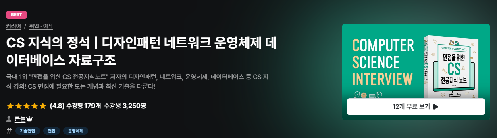

# 👨‍💻 개발자 면접을 위한 CS 스터디 : 탄젠트 
### 📅 일정 : 2024/09/23 (월) ~ 
 

## 📄 목표
1. 취업을 위한 면접 **CS 스터디**를 목표를 한다.
2. `Network`, `OS`, `Database`, `Java`, `Design Pattern`을 공부한다.
3. **SQLD 자격증 취득**을 위해 병행 공부한다.
 
 

## 🤔 방법
- 주어진 범위 각자 공부한 내용 깃허브에 `.md` 파일로 업로드

- 매주 **월요일 14:30**에 대면으로 만나서, 한 주동안 각자 공부한 내용 공유

- 면접 대비하여 **면접 예상 질문**과 **모범 답안** 준비하여 상대방에게 질문

- 매주 스터디가 끝나면 돌아가면서 교내  씨부엉 스터디에 활동일지 업로드

- 또한 Github Issue에 **면접 예상 질문** 정리해두어, 추후 돌려볼 수 있도록 함

- 큰돌의 **CS 지식의 정석** 강의 목차를 참고함.

   - [인프런 강의 : CS 지식의 정석 | 디자인패턴 네트워크 운영체제 데이터베이스 자료구조](https://www.inflearn.com/course/%EA%B0%9C%EB%B0%9C%EC%9E%90-%EB%A9%B4%EC%A0%91-cs-%ED%8A%B9%EA%B0%95)
  

## 📣 규칙
1. 매주 돌아가면서, **스터디 활동일지, Github Issue** 한 사람이 담당하여 작성하기

2. 일주일 공부 분량을 나누어 `Markdown` 형식으로 Github에 업로드

3. 스터디 전 까지 **면접 예상 질문, 모범 답안** 준비하기
  

## 📜 내용
- **네트워크** : 인프런 강의 [CS 지식의 정석]
- **운영체제** : 한국공학대학교 - 운영체제 강의안 
  
>이 일정들은 추후 변경될 수 있습니다.

| 회차 | 일정 | 스터디 내용 |
| :--: | :--: |:--: |
| 1회차 | 9/23 (월) | 스터디 계획 작성 |
| 2회차 | 9/30 (월) |**네트워크** : 네트워크 기초, OSI 계층   **운영체제** : 강의안 1장,2장
| 3회차 | 10/7 (월) | **네트워크** : 라우팅, IP 주소   **운영체제** : 강의안 3장, 4장 |
| 4회차 | 10/14 (월) | **네트워크** : HTTP   **운영체제** : 강의안 5장 ,6장 |
| 5회차 | 10/21 (월) | **네트워크** : 웹 브라우저 캐시, 로그인   **운영체제** : 강의안 7장 ,8장 |
| 6회차 | 10/28 (월) | **네트워크** : 트래픽, CORS, REST API, DNS, HTTP 멱동성   **운영체제** : 강의안 9장 ,10장 |
| 7회차 | 11/04 (월) | SQLD 공부 |
| 8회차 | 11/11 (월) | SQLD 공부 |
| 9회차 | 11/18 (월) | 데이터베이스 추가 공부 |
| 10회차 | 11/25 (월) | JAVA |
| 11회차 | 12/02 (월) | JAVA |
| 12회차 | 12/09 (월) | JAVA + Design Pattern |
